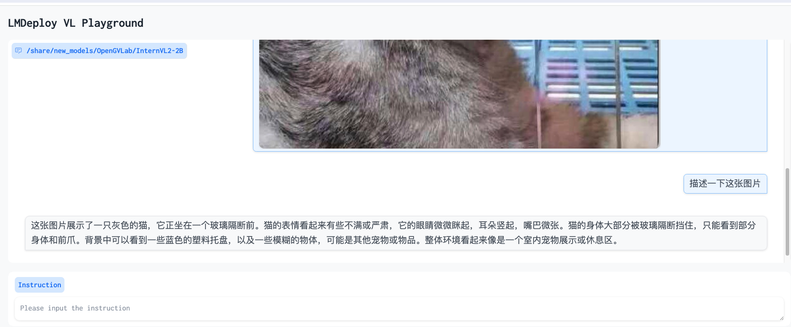

# 8G 显存玩转书生大模型 Demo

## 环境配置
运行命令时间较长,建议在tmux中运行

```bash
apt-get install tmux -y
tmux new -s demo
```


```bash
# 创建环境
conda create -n demo python=3.10 -y
# 激活环境
conda activate demo
# 安装 torch
conda install pytorch==2.1.2 torchvision==0.16.2 torchaudio==2.1.2 pytorch-cuda=12.1 -c pytorch -c nvidia -y
# 安装其他依赖
pip install transformers==4.38
pip install sentencepiece==0.1.99
pip install einops==0.8.0
pip install protobuf==5.27.2
pip install accelerate==0.33.0
pip install streamlit==1.37.0
```

## Cli Demo 部署 InternLM2-Chat-1.8B 模型

首先，我们创建一个目录，用于存放我们的代码。并创建一个 `cli_demo.py`。

```bash
mkdir -p /root/demo
touch /root/demo/cli_demo.py
```

然后，我们将下面的代码复制到 `cli_demo.py` 中。

## 模型下载
Intern的开发机不需要下载模型, 使用挂载的模型文件即可
```python
#shell中运行
pip install modelscope
pip install transformers
mkdir -p /root/share/new_models/

#在Python脚本中运行
import torch
from modelscope import snapshot_download, AutoModel, AutoTokenizer
import os
model_dir = snapshot_download('Shanghai_AI_Laboratory/internlm2-chat-1_8b', cache_dir='/root/share/new_models/', revision='master')
```


```python
import torch
from transformers import AutoTokenizer, AutoModelForCausalLM


model_name_or_path = "/root/share/new_models/Shanghai_AI_Laboratory/internlm2-chat-1_8b"

tokenizer = AutoTokenizer.from_pretrained(model_name_or_path, trust_remote_code=True, device_map='cuda:0')
model = AutoModelForCausalLM.from_pretrained(model_name_or_path, trust_remote_code=True, torch_dtype=torch.bfloat16, device_map='cuda:0')
model = model.eval()

system_prompt = """You are an AI assistant whose name is InternLM (书生·浦语).
- InternLM (书生·浦语) is a conversational language model that is developed by Shanghai AI Laboratory (上海人工智能实验室). It is designed to be helpful, honest, and harmless.
- InternLM (书生·浦语) can understand and communicate fluently in the language chosen by the user such as English and 中文.
"""

messages = [(system_prompt, '')]

print("=============Welcome to InternLM chatbot, type 'exit' to exit.=============")

while True:
    input_text = input("\nUser  >>> ")
    input_text = input_text.replace(' ', '')
    if input_text == "exit":
        break

    length = 0
    for response, _ in model.stream_chat(tokenizer, input_text, messages):
        if response is not None:
            print(response[length:], flush=True, end="")
            length = len(response)
```

接下来，我们便可以通过 `python /root/demo/cli_demo.py` 来启动我们的 Demo。


## Streamlit Web Demo 部署 InternLM2-Chat-1.8B 模型

在本节中，我们将演示如何使用 Streamlit 部署 InternLM2-Chat-1.8B 模型。

我们执行如下代码来把本教程仓库 clone 到本地，以执行后续的代码。

```bash
cd /root/demo
git clone https://github.com/InternLM/Tutorial.git
```

然后，我们执行如下代码来启动一个 Streamlit 服务。

```bash
cd /root/demo
streamlit run /root/demo/Tutorial/tools/streamlit_demo.py --server.address 127.0.0.1 --server.port 6006
```

接下来，我们在**本地**的 vsCode 将端口映射到本地。


在完成端口映射后，我们便可以通过浏览器访问 `http://localhost:6006` 来启动我们的 Demo。

效果如下图所示：


## 让他讲一个奥特曼大战吕布的故事


## LMDeploy 部署 InternLM-XComposer2-VL-1.8B 模型


首先，激活环境并安装 LMDeploy 以及其他依赖。

```bash
conda activate demo
pip install lmdeploy[all]==0.5.1
pip install timm==1.0.7
```

使用 LMDeploy 启动一个与 InternLM-XComposer2-VL-1.8B 模型交互的 Gradio 服务。

```bash
lmdeploy serve gradio /share/new_models/Shanghai_AI_Laboratory/internlm-xcomposer2-vl-1_8b --cache-max-entry-count 0.1
```

开启端口转发


在使用 Upload Image 上传图片后，我们输入 Instruction 后按下回车，便可以看到模型的输出。

识别效果还不错, 能知道眼神很犀利


## LMDeploy 部署 InternVL2-2B 模型

InternVL2 是上海人工智能实验室推出的新一代视觉-语言多模态大模型，是首个综合性能媲美国际闭源商业模型的开源多模态大模型。InternVL2 系列从千亿大模型到端侧小模型全覆盖，通专融合，支持多种模态。

LMDeploy 也已经支持了 InternVL2 系列模型的部署，让我们一起来使用 LMDeploy 部署 InternVL2-2B 模型。

我们可以通过下面的命令来启动 InternVL2-2B 模型的 Gradio 服务。

```bash
conda activate demo
lmdeploy serve gradio /share/new_models/OpenGVLab/InternVL2-2B --cache-max-entry-count 0.1
```

在完成端口映射后，我们便可以通过浏览器访问 `http://localhost:6006` 来启动我们的 Demo。

还是刚才犀利的猫咪,来看个效果



可以识别到这是在宠物店,相当厉害了!
